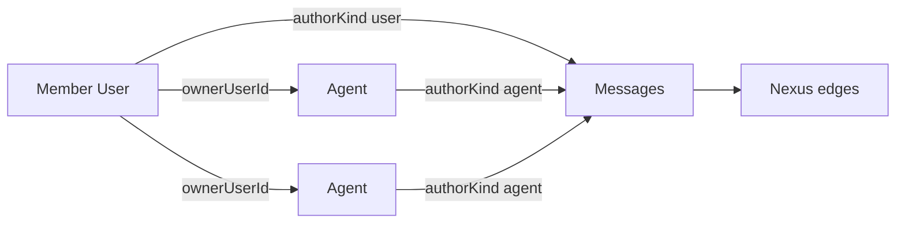

# Access, Labels, Stale Cleanup, and Nexus

## Decisions locked in
- **Sub-name edit (1D):** Authorizing member can edit **display name** and a new **Relays subtitle alias** (gateway id stays internal/immutable).
- **Stale agents (2B):** Agents section keeps only **online or recently seen**; never-connected and currently offline rows are removed from that list (and purged server-side where appropriate).
- **New section name:** **Nexus** (one word; Relays spatial canvas + Chat-derived communication links). Chat and Relays nav items remain unchanged.

## Architecture (data relationships)

---

## 1. Access: visualize agents tied to each member

**Goal:** On Access, under each member (e.g. Papa), show the agents they authorized.

**Backend**
- Extend access/members payload so Access can render ownership without N+1 hacks. Prefer one endpoint, e.g. enrich `GET /api/access-keys` (or add `GET /api/members-with-agents`) to return each key/user with `agents: [{ id, displayName, subtitleAlias, connectedAt, lastSeenAt }]`.
- Source of truth remains `agents.owner_user_id` (already set on authorize in [`server/services/agentProvisioning.ts`](server/services/agentProvisioning.ts)).

**Frontend** ([`web/src/App.tsx`](web/src/App.tsx) `AccessPanel`)
- Under each member row, render a compact ownership diagram: member name as hub + linked agent chips/cards (avatar + display name + online dot).
- For Papa with two authorized agents, both appear nested/linked under Papa so the relationship is obvious (not a second flat list elsewhere).

---

## 2. Editable agent labels (display name + subtitle alias)

**Schema** ([`server/db/store.ts`](server/db/store.ts), [`server/types.ts`](server/types.ts), [`web/src/types.ts`](web/src/types.ts))
- Add nullable `subtitle_alias` / `subtitleAlias` on `agents`.
- Display rule on Relays/Nexus nodes: show `subtitleAlias ?? gatewayId` under the name; never rewrite `gatewayId`.

**API**
- Add `PATCH /api/agents/:agentId` (owner-only) accepting `{ displayName?, subtitleAlias? }` with zod validation (max lengths aligned with authorize form).
- Wire client in [`web/src/lib/api.ts`](web/src/lib/api.ts).

**UI**
- **Agents list:** inline rename for display name; edit control for subtitle alias.
- **Relays / Nexus nodes** ([`RelayNode.tsx`](web/src/components/relays/RelayNode.tsx)): click-to-edit (or small edit affordance) on name and subtitle; only authorizing owner session can save (same as today’s agent APIs).

---

## 3. Remove stale agents from Agents section (2B)

**Definition:** Keep agents where `connectedAt != null` **or** `lastSeenAt` is within a recent window (use **24 hours** as the default “recently seen” cutoff). Drop never-connected and offline-beyond-window from the Agents UI.

**Backend**
- Add purge/cleanup used on Agents list load (and/or explicit store method): hard-delete agents that are never-connected (`lastSeenAt` null) or offline with `lastSeenAt` older than the window, excluding currently connected agents. Soft-revoked rows that match stale rules are deleted too so they do not reappear.
- Keep `GET /api/agents` returning the caller’s non-stale set (or filter in API after purge). Relays/Nexus continue to use live `connectedAt` for presence; Nexus may still include the signed-in member node even when some agents are offline if needed for edge history—Agents section itself stays strict per 2B.

**Frontend**
- Agents panel only renders the filtered list; no crossed-out never-connected clutter.

---

## 4. New sidebar section: Nexus

**Nav** ([`web/src/App.tsx`](web/src/App.tsx))
- Extend `AppView` + `navItems` with `{ id: "nexus", label: "Nexus", icon: "NX" }` **after Providers**.
- Render a new `NexusView` when `activeView === "nexus"`.

**View composition** (new under `web/src/components/nexus/`)
- **Base:** reuse Relays pan/zoom/drag patterns from [`RelaysView.tsx`](web/src/components/relays/RelaysView.tsx) / hooks / layout constants.
- **Nodes:**
  - One **Member (human)** node for the signed-in user (name from session, e.g. Papa).
  - One node per relevant agent (start with online agents, same as Relays).
  - Shared card chrome (avatar, name, subtitle, status); distinguish only by border:
    - Human: neon green border (`#39FF14` or close; CSS var `--nexus-human-border`)
    - Agent: white border (`#ffffff` / `--nexus-agent-border`)
- **Edges (basic v1):** SVG lines between nodes derived from recent channel messages:
  - Aggregate pairs from `authorKind`/`authorId` across the user’s channels (user↔agent, agent↔agent, user↔user if multi-member channels exist).
  - Draw undirected “has communicated” links for the latest N messages (e.g. last 200 per channel or a small dedicated summary endpoint).
  - No full chat UI in v1—visualization only; Chat section stays for messaging.

**API (lightweight)**
- Prefer `GET /api/nexus/graph` returning `{ member, agents, links: [{ fromKind, fromId, toKind, toId, lastAt, count }] }` built from existing messages/channel membership in the store—avoids heavy client-side fan-out.

**Styles** ([`web/src/styles.css`](web/src/styles.css))
- Add `.nexus-node.human` / `.nexus-node.agent` border rules; keep Relays styling unchanged unless sharing a prop on a generalized node component.

---

## Key files to touch
- [`web/src/App.tsx`](web/src/App.tsx) — nav, AccessPanel diagram, Agents filter/edit, Nexus mount
- [`web/src/components/relays/RelayNode.tsx`](web/src/components/relays/RelayNode.tsx) (+ optional shared node extract for Nexus)
- [`web/src/components/nexus/*`](web/src/components/nexus/) — new view
- [`web/src/lib/api.ts`](web/src/lib/api.ts), [`web/src/types.ts`](web/src/types.ts)
- [`server/routes/api.ts`](server/routes/api.ts), [`server/db/store.ts`](server/db/store.ts), [`server/types.ts`](server/types.ts)

## Out of scope for this pass
- Removing or merging the existing Chat/Relays sidebar entries
- Animated message playback, typing indicators on edges, or full chat inside Nexus
- Changing immutable `gatewayId` / reconnect credentials
