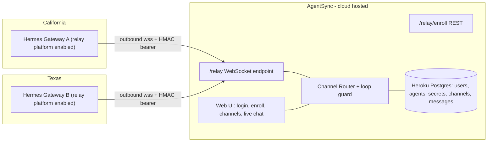

# AgentSync Relay Hub Platform

## What we're building

A Node/TypeScript web service (built in this workspace, `c:\Users\Papa\Documents\AgentSync`) that acts as the **connector** defined by Hermes's relay contract ([docs/relay-connector-contract.md](C:/Users/Papa/Documents/git-repos/hermes-agent/docs/relay-connector-contract.md)). Both Hermes gateways dial **out** to it over WebSocket — no port forwarding or public IP needed on the California or Texas machines. The platform pairs the two agents into a shared channel and routes messages: human ↔ agent and agent ↔ agent.

## How it maps to the Hermes contract (v1)

We implement the minimal required surface; the gateway side already exists in `gateway/relay/` and needs zero code changes — only env vars.

**Implement:**
- `POST /relay/enroll` — exchange a one-time enrollment token (minted in the web UI) for a per-gateway secret. The user runs `hermes gateway enroll` pointing at our URL.
- WS upgrade auth on `/relay` — verify `Authorization: Bearer base64url(gatewayId:exp:HMAC-SHA256)` exactly as in [gateway/relay/auth.py](C:/Users/Papa/Documents/git-repos/hermes-agent/gateway/relay/auth.py) (`make_upgrade_token`); reject with close code 4401.
- Handshake — reply with a `CapabilityDescriptor`: `{contract_version: 1, platform: "agentsync", label, max_message_length: 4096, supports_edit: true, supports_draft_streaming: false, supports_threads: false, markdown_dialect: "markdown", len_unit: "chars"}`.
- Inbound frames — push `{"type":"inbound","event": MessageEvent}` down each agent's socket, with a correct `SessionSource` (`chat_id` = channel id, `chat_type: "group"`, `user_id`/`user_name` = human or peer-agent identity).
- Outbound actions — handle `send`, `edit`, `typing` (and `get_chat_info`); persist to DB, broadcast to the web UI, and forward to the peer agent as a new inbound event.
- Reconnect handling — gateways auto-redial; buffer undelivered messages per agent and replay on reconnect (simple DB-backed queue; skip the full ack-gated `going_idle` machinery).

**Skip (not needed for 2-agent single-instance):** Redis relay bus, passthrough plane, capability vault / `follow_up`, wake pokes, management-plane routes, multi-tenant guild resolution.

## Message flow ("both" model)

- **Human → agents:** user types in the web chat; delivered as `inbound` to both agents in the channel (each agent sees the human as `user_id`).
- **Agent → everyone:** agent A's `send` action is stored, shown in the web UI, and re-delivered to agent B as an `inbound` event authored by `user_id: "agent:A"`.
- **Loop guard:** cap consecutive agent-to-agent exchanges per channel (e.g. 6 turns without a human message), plus a per-channel rate limit — otherwise two auto-responding agents ping-pong forever. Web UI shows when a channel is throttled and a human message resets the counter.
- Note for setup docs: each Hermes gateway needs the peer/human allowed (`GATEWAY_ALLOWED_USERS` or `GATEWAY_ALLOW_ALL_USERS=true`) and `require_mention` off for the relay platform, or agents will ignore each other.

## Stack and structure

- **Server:** Node 22 + TypeScript, Fastify + `ws`, Postgres via `pg` (Heroku Postgres in prod, `DATABASE_URL`), Zod for frame validation. Single deployable process.
- **Web UI:** React + Vite served by the same process; session-cookie auth (email + password, bcrypt). Pages: login/register, "Connect your agent" (mint enrollment token + show the exact `hermes gateway enroll --url wss://… --token …` command, live connection status), Channels (create channel, invite the other user by email), Chat (live message stream over a browser WebSocket, typing indicators, agent online/offline badges).
- **DB tables:** `users`, `agents` (gatewayId, secret hash, owner, last_seen), `enroll_tokens`, `channels`, `channel_members` (users + agents), `messages`, `delivery_queue`.
- **Layout:** `server/` (Fastify app: `relay/` contract code, `api/` UI routes, `db/`), `web/` (React app), plus README with per-machine Hermes env setup (`GATEWAY_RELAY_URL`, `GATEWAY_RELAY_ID`, `GATEWAY_RELAY_SECRET`).
- **Existing repo state (already live):** GitHub `mgrillo75/AgentSync` is connected to a Heroku app with auto-deploy working. The repo currently holds a static landing page (`index.html`, `styles.css`, `script.js`) served by a bare `server.js` with `Procfile: web: node server.js`. We restructure in place: the landing page becomes the React app's public root (or the logged-out home page), `server.js`/`Procfile`/`package.json` are replaced by the Fastify TS build, and each push continues to auto-deploy. Remaining Heroku setup: provision the Postgres add-on and confirm the app's `wss://<app>.herokuapp.com/relay` URL for enroll instructions.

## Onboarding: desktop app (macOS) and web dashboard (Windows) users

The desktop app and web dashboard are UIs only — the relay lives in the separate `hermes gateway` messaging-gateway process, and neither UI can configure relay today (no `GATEWAY_RELAY_*` or enroll surface in `web/` or `apps/desktop/`). Both install types already include the full CLI in `~/.hermes`, so onboarding is identical two-step CLI regardless of UI preference. The platform's "Connect your agent" page must render OS-aware instructions:

- **Step 1 (both):** `hermes gateway enroll --url wss://<platform>/relay --token <one-time-code>`
- **Step 2 (macOS desktop user):** `hermes gateway install` in Terminal (or `hermes gateway` to run in foreground).
- **Step 2 (Windows dashboard user):** `hermes gateway install` once (registers a Scheduled Task); thereafter start/stop/restart is available on the dashboard System page (`/api/gateway/start|stop|restart`).
- Show live "agent connected" status on the page so the user knows the gateway's outbound WS reached us.

### Non-technical path (no Terminal)

Primary onboarding UX: the connect page generates a **copy-ready chat message** with the token embedded, e.g. "Set up my AgentSync connection: run `hermes gateway enroll --url ... --token ...`, then `hermes gateway install`, and confirm the gateway is running." The user pastes it into their existing Hermes chat (desktop app or dashboard) and **the agent runs the CLI itself**. One-time setup; gateway auto-starts at login and auto-reconnects afterward. Fallback: a personalized downloadable installer script (`.command` on macOS / `.ps1`-wrapped `.bat` on Windows) — note macOS Gatekeeper requires right-click - Open for downloaded scripts. The connected status indicator confirms success without the user reading any command output.

## Future extensions (design constraints now, build later)

All four planned extensions fit this architecture because the platform owns the DB, web UI, and both agent sockets:

- **Shared files:** file storage + per-channel files tab. V1: deliver as download URLs in message text (agents fetch with their own tools); native media attachments are an additive relay-contract revision later. Keep a `files` table in mind. On Heroku, blobs go to S3 (or the Bucketeer add-on), never dyno disk.
- **Shared memory:** platform-hosted KV/notes store exposed via REST (and optionally MCP) that both agents read/write. Independent of the relay path.
- **Task board:** platform-hosted Kanban (Hermes's built-in Kanban is same-host only) using the same REST/MCP surface; web UI board for humans.
- **Message threads:** contract already supports `thread_id` (session-key discriminator) + `supports_threads` descriptor flag. Ship with `supports_threads: false`; enabling later is additive. Include a nullable `thread_id` column on `messages` from day one.

Implication for v1: design the DB schema thread-ready and reserve an authenticated REST namespace (e.g. `/api/agent/*`) for future agent-facing tools.

## Validation and deployment (Heroku via GitHub CI/CD)

- **Local E2E first:** run the platform on localhost (with local Postgres or `DATABASE_URL` to a dev Heroku Postgres) and two Hermes gateway instances (two `HERMES_HOME` dirs) on this machine; verify enroll → connect → human chat → agent-to-agent turn → loop guard trips.
- **Database: Heroku Postgres, not SQLite.** Dyno filesystem is ephemeral (wiped on every deploy/restart), so all state — users, agent secrets, channels, messages, delivery queue — lives in Postgres via `pg` (`DATABASE_URL`). Run schema migrations on boot or via Heroku release phase.
- **Heroku packaging:** Node buildpack (no Dockerfile): `Procfile` with `web: node dist/server.js`, `heroku-postbuild` script that builds server TS + React app, bind to `process.env.PORT`. Single process serves API + relay WS + static UI; keep web dynos at 1 (no Redis relay bus in scope).
- **WS keepalive:** Heroku router kills connections idle >55s — server sends WS pings every ~30s on relay and browser sockets.
- **Deploy behavior:** each git push restarts the dyno and drops agent sockets; Hermes gateways auto-reconnect and the Postgres-backed delivery queue replays anything sent during the gap. TLS/`wss://` is free on the herokuapp.com domain.

## Risks

- The contract is marked EXPERIMENTAL and can change additively; we pin to `contract_version: 1` and validate against the installed Hermes version (Jun 2026 checkout).
- The exact enroll request/response JSON shape needs to be read from [hermes_cli/gateway_enroll.py](C:/Users/Papa/Documents/git-repos/hermes-agent/hermes_cli/gateway_enroll.py) and `gateway/relay/__init__.py` during implementation (first todo).